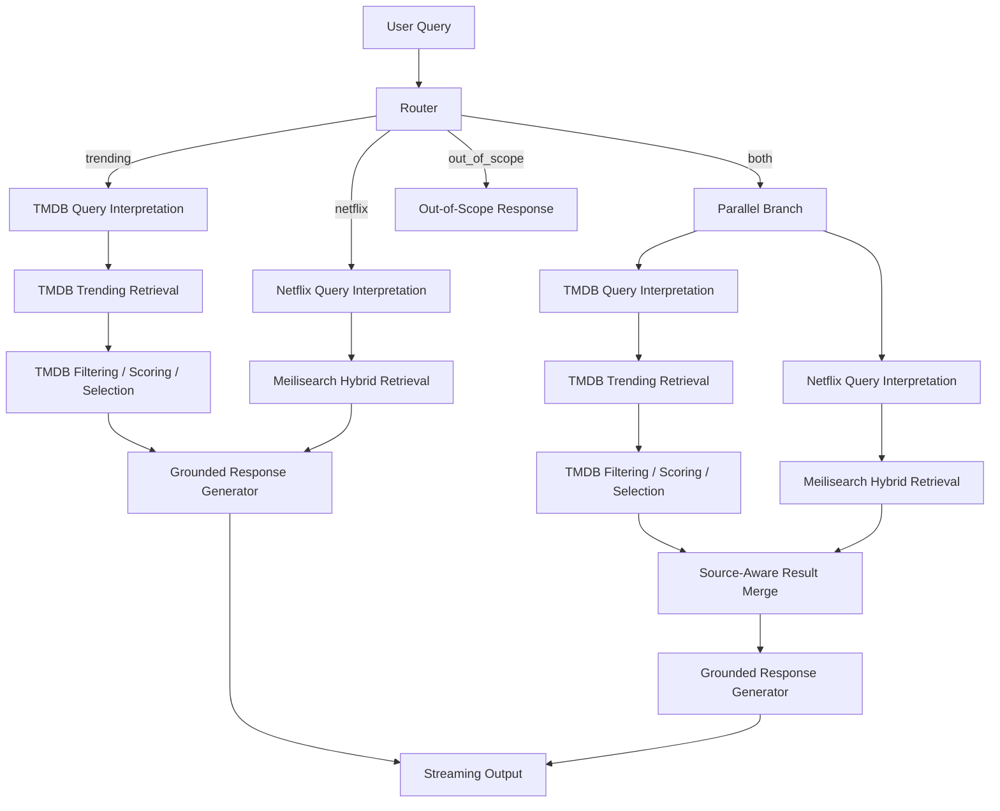

# Fase 0 — Diseño y Planificación Técnica

## Movie Recommendation Chatbot — GenAI Engineer Take-Home Assessment

**Estado:** Completada  
**Propósito:** cerrar las principales decisiones de arquitectura, comportamiento, recuperación de información y contratos del sistema antes de comenzar la implementación.

---

# 1. Objetivo de la Fase 0

El objetivo de esta fase es transformar los requisitos del assessment en un diseño técnico explícito, defendible y testeable.

El sistema debe responder consultas de recomendación de películas utilizando dos fuentes diferenciadas:

1. **TMDB Trending Movies**, para recomendaciones de películas actualmente en tendencia.
2. **Netflix Movies and Shows Dataset**, para recomendaciones dentro del catálogo representado por el dataset de Kaggle.

El diseño debe además contemplar:

- routing entre ambos dominios;
- consultas que puedan ser razonablemente respondidas por ambas fuentes;
- respuestas en streaming;
- ocultación de errores técnicos al usuario;
- contratos de datos validados;
- comportamiento reproducible en evaluación;
- código modular y mantenible.

La Fase 0 no implementa todavía el producto. Su función es reducir incertidumbre y fijar qué se construirá, cómo se organizará y qué complejidad se decide dejar fuera.

---

# 2. Principios de diseño

## 2.1 Separar interpretación, recuperación y generación

La arquitectura debe separar claramente tres responsabilidades:

```text
Interpretar la intención del usuario
        ↓
Recuperar candidatos desde fuentes externas
        ↓
Generar una respuesta grounded
```

El LLM no será la fuente de verdad.

Su función será principalmente:

- comprender lenguaje natural;
- producir salidas estructuradas;
- adaptar consultas a cada datasource;
- redactar la respuesta final.

Los hechos sobre películas deben proceder de TMDB o del dataset Netflix.

---

## 2.2 Mantener los dos dominios separados

TMDB y Netflix representan problemas distintos.

No se intentará resolver ambos con una arquitectura RAG genérica.

### TMDB

```text
Dynamic API result
→ filtering
→ scoring
→ candidate selection
```

### Netflix

```text
Static catalog
→ hybrid retrieval
→ hard filters
→ Top-K selection
```

Esto permite elegir la técnica adecuada para cada fuente en lugar de introducir abstracciones artificiales.

---

## 2.3 Favorecer comportamiento útil en el primer turno

Si una consulta puede ser satisfecha razonablemente por ambas fuentes, el sistema no obligará al usuario a aclarar primero si quiere:

```text
trending movies
o
Netflix catalog
```

En lugar de introducir un turno adicional, se consultarán ambas fuentes y se presentarán recomendaciones diferenciadas.

La conversación posterior permitirá al usuario restringir la búsqueda si lo desea.

---

## 2.4 Minimizar complejidad no justificada

El assessment debe demostrar criterio técnico, no cantidad de componentes.

Por esta razón se decide:

- usar LangGraph;
- usar Pydantic;
- no implementar planner;
- no implementar un agente especializado de desambiguación;
- no implementar un reranker LLM en la primera versión;
- no introducir una capa agentic genérica de tool selection.

La arquitectura debe ser explícita y fácil de razonar.

---

# 3. Arquitectura general

El sistema se organizará alrededor de un grafo de ejecución controlado.



La arquitectura mantiene únicamente dos agentes especializados:

- TMDB Agent;
- Netflix Agent.

El router y los nodos de orquestación no se consideran agentes de dominio.

---

# 4. Decisión de routing

## 4.1 Rutas soportadas

El router devolverá una de cuatro rutas:

```python
TRENDING
NETFLIX
BOTH
OUT_OF_SCOPE
```

Esta definición sustituye una propuesta inicial basada en:

```python
TRENDING
NETFLIX
AMBIGUOUS
OUT_OF_SCOPE
```

La diferencia es intencional.

`AMBIGUOUS` describe una propiedad de la consulta.

`BOTH` describe una acción concreta del sistema.

El router debe producir decisiones operativas, por lo que `BOTH` es una representación más útil.

---

# 5. Política de routing

## 5.1 Route `TRENDING`

Se utilizará cuando la consulta contenga una intención temporal clara relacionada con actualidad o tendencias.

Ejemplos:

```text
"What is a good recent movie?"
"What is trending now?"
"Any good superhero movie lately?"
"What is the current best movie?"
```

Señales orientativas:

```text
recent
latest
lately
today
current
trending
new
released recently
```

---

## 5.2 Route `NETFLIX`

Se utilizará cuando la consulta haga referencia explícita al catálogo Netflix o cuando el dominio esté suficientemente restringido hacia esa fuente.

Ejemplos:

```text
"Find me a Netflix spy movie"
"What are some good Netflix nature documentaries?"
"I want a Netflix series about politics"
```

---

## 5.3 Route `BOTH`

Se utilizará cuando la intención del usuario pueda satisfacerse razonablemente desde ambas fuentes y no exista una preferencia clara por actualidad o Netflix.

Ejemplos:

```text
"Recommend me a comedy"
"I want something about superheroes"
"Any good romantic movie?"
"Recommend me something to watch tonight"
```

En estos casos el sistema:

```text
Router
   ↓
BOTH
  ↙   ↘
TMDB  Netflix
  ↘   ↙
Source-aware combined response
```

---

# 6. Decisión: no crear un agente especializado de desambiguación

## 6.1 Decisión

No se implementará un tercer agente cuya responsabilidad sea "desambiguar".

## 6.2 Motivos

El sistema sólo tiene dos fuentes funcionales.

La ambigüedad entre ellas no requiere una nueva capacidad especializada.

El router ya dispone de suficiente contexto para decidir entre:

```text
TMDB
Netflix
Both
Out of scope
```

Añadir un agente adicional introduciría:

- una nueva llamada al LLM;
- mayor latencia;
- más complejidad;
- mayor superficie de testing;
- una abstracción sin responsabilidad de dominio propia.

Además, el assessment define dos agentes especializados asociados a los dos tipos de consultas principales. Mantener exactamente esos dos agentes produce una arquitectura más coherente con el problema.

---

# 7. Decisión: una consulta ambigua entre fuentes ejecuta ambas

## 7.1 Alternativa descartada

Una opción posible era:

```text
User:
"Recommend me a comedy"

Assistant:
"Do you want something currently trending or something on Netflix?"
```

Esta solución es válida pero introduce un turno adicional antes de ofrecer valor.

## 7.2 Decisión

Cuando ambas fuentes sean aplicables, se buscará en ambas.

Ejemplo conceptual:

```text
User:
"Recommend me a comedy"

Assistant:
Trending now:
- ...

From the Netflix catalog:
- ...
```

## 7.3 Justificación

Esta política tiene varias ventajas.

### Mejor time-to-value

El primer turno ya devuelve recomendaciones.

### Menor fricción

El usuario no necesita comprender la arquitectura interna para obtener una respuesta.

### La conversación resuelve la preferencia de forma natural

Después de recibir ambas opciones el usuario puede responder:

```text
"Give me another Netflix one"
```

o:

```text
"I prefer the trending option"
```

La siguiente consulta podrá enrutar directamente a la fuente correspondiente.

### Comportamiento agentic útil

El sistema puede ejecutar más de una herramienta cuando la intención lo justifica, sin introducir planificación abierta.

Esto aporta comportamiento agentic real:

```text
classify
→ choose one or two branches
→ execute specialized retrieval
→ combine results
```

sin necesidad de un planner.

---

# 8. Router estructurado

El router devolverá un objeto validado.

```python
from typing import Literal
from pydantic import BaseModel, Field


class RouteDecision(BaseModel):
    route: Literal[
        "trending",
        "netflix",
        "both",
        "out_of_scope",
    ]

    confidence: float = Field(ge=0.0, le=1.0)
    reason: str
```

El campo `reason` tendrá uso interno:

- debugging;
- evaluación;
- observabilidad.

No será utilizado para exponer razonamiento interno al usuario.

---

# 9. LangGraph como capa de orquestación

## 9.1 Decisión

Se utilizará LangGraph para representar el workflow.

## 9.2 Justificación

Aunque el problema podría implementarse con condicionales convencionales, LangGraph permite demostrar una arquitectura agentic explícita basada en estados y transiciones.

Aporta:

- rutas declarativas;
- estado compartido;
- nodos testeables;
- conditional edges;
- ejecución paralela para `BOTH`;
- rutas de error;
- extensibilidad;
- observabilidad.

El caso `BOTH` refuerza particularmente esta decisión, porque el grafo puede expresar de forma natural un fan-out/fan-in:

```text
         Router
           ↓
          BOTH
        ↙      ↘
     TMDB    Netflix
        ↘      ↙
          Merge
            ↓
         Response
```

---

# 10. Decisión: no implementar planner

## 10.1 Decisión

No habrá planner.

## 10.2 Motivo

Las acciones posibles están conocidas de antemano.

El sistema no necesita decidir dinámicamente una secuencia arbitraria de herramientas.

El flujo se encuentra limitado a:

```text
route
→ interpret
→ retrieve
→ select
→ generate
```

o, para `BOTH`:

```text
route
→ [TMDB + Netflix]
→ merge
→ generate
```

Un planner introduciría autonomía innecesaria y dificultaría:

- testing;
- observabilidad;
- reproducibilidad;
- control de errores.

LangGraph se utilizará como **workflow explícito**, no como soporte para planificación abierta.

---

# 11. Pydantic y contratos estructurados

Pydantic será utilizado para validar los principales intercambios entre componentes.

## 11.1 Motivos

- validación temprana;
- contratos explícitos;
- parsing fiable de structured outputs;
- serialización;
- legibilidad;
- facilidad de testing;
- reducción de integración accidental entre componentes.

---

# 12. Estado conceptual del grafo

```python
class ChatState(BaseModel):
    user_query: str

    route: RouteDecision | None = None

    trending_query: TrendingQuery | None = None
    netflix_query: NetflixQuery | None = None

    tmdb_candidates: list[MovieCandidate] = []
    netflix_candidates: list[MovieCandidate] = []

    warnings: list[str] = []
    status: str = "pending"
```

Mantener candidatos separados por datasource es deliberado.

Esto facilita:

- factualidad;
- observabilidad;
- generación source-aware;
- presentación diferenciada;
- evaluación por fuente.

---

# 13. Contrato común de candidatos

Los agentes tendrán implementaciones distintas, pero convergerán en un modelo común.

```python
from typing import Literal
from pydantic import BaseModel


class MovieCandidate(BaseModel):
    id: str
    title: str
    description: str | None = None

    release_year: int | None = None
    genres: list[str] = []

    source: Literal["tmdb", "netflix"]

    popularity: float | None = None
    vote_average: float | None = None
```

No todos los campos están disponibles en ambas fuentes.

El schema representa un contrato común sin inventar datos inexistentes.

---

# 14. Resultado de un agente

```python
class AgentResult(BaseModel):
    candidates: list[MovieCandidate]
    query_interpretation: dict
    warnings: list[str] = []
```

El agente es responsable de producir candidatos grounded.

La redacción final se mantiene separada.

---

# 15. Diseño del agente TMDB

## 15.1 TMDB no es RAG

El agente TMDB no se modelará como Retrieval-Augmented Generation.

El endpoint permitido ya define un conjunto candidato de películas actualmente en tendencia.

El problema consiste en:

```text
User query
    ↓
Preference extraction
    ↓
TMDB Trending Movies endpoint
    ↓
Filtering
    ↓
Scoring
    ↓
Candidate selection
```

---

# 16. Restricción del datasource TMDB

La implementación utilizará únicamente el endpoint `Trending Movies` permitido por el assessment.

No se llamarán silenciosamente otros endpoints para enriquecer:

- keywords;
- credits;
- providers;
- additional genre metadata;
- discover queries.

Esta limitación forma parte del diseño.

Cuando una preferencia no pueda comprobarse con los datos disponibles:

- no se inventará información;
- se utilizarán únicamente las señales disponibles;
- el sistema podrá degradar la precisión del filtro;
- la respuesta evitará afirmaciones no respaldadas.

---

## 16.1 Ventana temporal de Trending

El endpoint de Trending Movies de TMDB utiliza el parámetro `time_window` y actualmente solo admite dos valores:

```text
day
week
```

La implementación inicial utilizará `week` por defecto.

La ventana `day` solo se utilizará cuando el usuario especifique claramente una intención diaria, por ejemplo:

```text
"¿Qué películas son tendencia hoy?"
"Dime las tendencias de hoy"
"What's trending today?"
```

Expresiones como `trending`, `now`, `current`, `latest` o `recent`, sin una referencia explícita a “hoy”, no cambiarán la ventana por defecto: se resolverán con `week`.

La API no ofrece ventanas nativas de un mes o de un año. Esas ventanas no se simularán cambiando silenciosamente de endpoint. Si se necesitan en el futuro, las alternativas serán:

- almacenar snapshots diarios o semanales y calcular una agregación propia;
- utilizar `discover/movie` con filtros temporales, documentando que se trata de popularidad/descubrimiento y no de Trending.

La documentación oficial de TMDB define las ventanas permitidas en [Trending Movies](https://developer.themoviedb.org/reference/trending-movies).

---

# 17. Query schema TMDB

```python
from typing import Literal


class TrendingQuery(BaseModel):
    keywords: list[str] = []
    genres: list[str] = []
    time_window: Literal["day", "week"] = "week"
    preferred_recency: bool = True
    min_rating: float | None = None
```

En la implementación inicial del conector, la ventana queda fijada a `week`. La interpretación de `time_window` y la selección de `day` cuando el usuario diga claramente “hoy” forman parte de la evolución del agente y requerirán una tarea de implementación específica.

Ejemplo:

```text
"Is there a good movie to watch about superheroes lately?"
```

Interpretación:

```json
{
  "keywords": ["superhero"],
  "genres": ["superhero"],
  "time_window": "week",
  "preferred_recency": true,
  "min_rating": null
}
```

El schema expresa la intención.

La capa TMDB será responsable de determinar qué criterios pueden aplicarse realmente utilizando los campos disponibles en el endpoint.

---

# 18. Scoring y selección de candidatos

## 18.1 Diferencia entre scoring y reranking

Esta distinción queda cerrada explícitamente en Fase 0.

### Scoring / candidate selection

Forma parte de la propia recuperación.

Ejemplo TMDB:

```text
Trending response
    ↓
filter candidates
    ↓
calculate simple relevance score
    ↓
select Top-K
```

Ese score puede utilizar señales como:

```text
query relevance
popularity
vote average
recency
```

El objetivo es decidir qué candidatos del conjunto recuperado son más adecuados.

No existe un segundo modelo especializado que vuelva a ordenar resultados.

### Reranking

Un reranker sería una etapa adicional posterior al retrieval inicial.

Ejemplo:

```text
Retrieval
    ↓
Top 20
    ↓
LLM / cross-encoder reranker
    ↓
Top 5
```

Esta segunda etapa es la que se decide dejar fuera.

---

# 19. Decisión: no implementar reranker en la primera versión

## 19.1 Decisión

No se implementará un reranker LLM ni un cross-encoder dentro del alcance inicial.

## 19.2 Justificación

Un reranker introduce:

- una llamada adicional;
- mayor latencia;
- mayor coste;
- más no determinismo;
- otra pieza que evaluar;
- más complejidad operativa.

En Netflix, Meilisearch ya proporciona una estrategia de relevancia híbrida.

En TMDB, el conjunto candidato es pequeño y permite aplicar scoring directo.

Por tanto, antes de introducir un reranker debe existir evidencia de que:

```text
initial retrieval quality
<
required recommendation quality
```

La complejidad se añadirá sólo si la evaluación demuestra una necesidad.

---

# 20. Reranking como trabajo futuro

Se documenta como evolución posible.

Arquitectura futura:

```text
Retriever
    ↓
Top 20
    ↓
Reranker
    ↓
Top 5
    ↓
Answer
```

Alternativas:

### LLM reranker

Consulta + candidatos como structured input, devolviendo IDs ordenados.

### Cross-encoder

Scoring directo de pares:

```text
query
candidate
```

### Scoring híbrido más sofisticado

Combinación explícita de:

```text
retrieval relevance
metadata match
genre match
rating
popularity
```

La incorporación del reranker debería justificarse mediante métricas, no únicamente por sofisticación arquitectónica.

---

# 21. TMDB fixtures para testing y evaluación

## 21.1 Decisión

No se utilizará un mirror histórico de TMDB como datasource alternativo.

Se utilizarán fixtures versionados del endpoint.

## 21.2 Motivos

Las tendencias cambian diariamente.

Una evaluación que dependa de datos live produciría resultados distintos entre ejecuciones.

Los fixtures permiten:

- reproducibilidad;
- tests deterministas;
- evaluación offline;
- simulación de errores;
- comparación entre versiones.

Arquitectura:

```text
Production / demo:
TMDB Agent
→ Live TMDB Repository
→ TMDB API

Tests / evaluation:
TMDB Agent
→ Fixture TMDB Repository
→ Versioned response
```

El agente no cambia.

Sólo se sustituye la implementación del repository mediante dependency injection.

---

# 22. Diseño del agente Netflix

## 22.1 Netflix sí es un problema RAG

El dataset contiene contenido textual y metadata estructurada.

Las consultas del usuario pueden contener simultáneamente:

- restricciones verificables;
- intención semántica.

Ejemplo:

```text
"I want an action movie involving spies"
```

Puede interpretarse como:

```text
Hard filters:
type = movie
genre = action

Semantic query:
spies
espionage
secret agents
undercover missions
```

---

# 23. Meilisearch como motor de retrieval

## 23.1 Decisión

Se utilizará Meilisearch.

## 23.2 Justificación

Meilisearch es adecuado porque permite combinar:

```text
lexical search
+
semantic search
+
hard filters
```

en una única capa de retrieval.

Además:

- existe experiencia previa con el motor;
- simplifica el desarrollo;
- tiene una API clara;
- permite filtrado estructurado;
- ofrece latencia adecuada para interacción;
- evita introducir varios sistemas de búsqueda innecesariamente.

La experiencia previa con la herramienta reduce riesgo de implementación, lo que es relevante en un assessment con alcance y tiempo limitados.

---

# 24. Query schema Netflix

```python
from typing import Literal


class NetflixQuery(BaseModel):
    semantic_query: str

    type: Literal["movie", "show", "any"] = "any"
    genres: list[str] = []

    min_year: int | None = None
    max_year: int | None = None

    age_certification: list[str] = []
```

Ejemplo:

```text
"I want an action movie involving spies"
```

Resultado aproximado:

```json
{
  "semantic_query": "spy espionage undercover secret agent",
  "type": "movie",
  "genres": ["action"],
  "min_year": null,
  "max_year": null,
  "age_certification": []
}
```

---

# 25. Separación entre filtros duros y búsqueda semántica

## Hard filters

Ejemplos:

```text
movie / show
genre
release year
age certification
```

## Semantic intent

Ejemplos:

```text
spy missions
political intrigue
nature exploration
slow-burn romance
family conflict
undercover investigation
```

La búsqueda semántica no debe asumir responsabilidades que pueden resolverse de forma determinista mediante filtros.

Esto mejora:

- precisión;
- explicabilidad;
- consistencia;
- evaluación.

---

# 26. Pipeline Netflix

```text
Natural-language query
        ↓
NetflixQuery extraction
        ↓
Meilisearch
    ├── hard filters
    ├── lexical relevance
    └── semantic relevance
        ↓
Top-K candidates
        ↓
Grounded response
```

No existe una segunda etapa de reranking.

El `Top-K` se definirá en la fase de evaluación.

---

# 27. Ejecución de la ruta BOTH

Cuando el router devuelva:

```python
route = "both"
```

el sistema ejecutará ambos agentes.

Idealmente, LangGraph permitirá ejecutar ambas ramas de forma paralela.

```text
           BOTH
        ↙        ↘
     TMDB       Netflix
      ↓            ↓
 candidates    candidates
        ↘        ↙
       merge node
```

El merge no construirá un ranking global.

Su responsabilidad será conservar la procedencia de cada resultado y preparar la información para la respuesta final.

---

# 28. Decisión: no mezclar fuentes en un ranking único

## 28.1 Decisión

Los resultados TMDB y Netflix se presentarán separados por procedencia.

No se generará una lista como:

```text
1. Netflix movie
2. Trending movie
3. Netflix show
4. Trending movie
```

## 28.2 Motivo

Las dos fuentes expresan señales distintas.

Un resultado TMDB significa:

```text
currently present in TMDB trending data
```

Un resultado Netflix significa:

```text
relevant match within the indexed Netflix dataset
```

Estas señales no son directamente comparables.

Mezclarlas en un ranking único podría transmitir una relación de calidad o relevancia que el sistema no ha calculado realmente.

---

# 29. Presentación source-aware

La respuesta mantendrá una separación conceptual clara.

Ejemplo:

```text
Trending now
------------
...

From the Netflix catalog
------------------------
...
```

La redacción final puede ser conversacional, pero debe preservar esa distinción.

Esto ayuda al usuario a interpretar qué significa cada recomendación.

---

# 30. Decisión: limitar afirmaciones según la fuente

La procedencia del candidato determina qué afirmaciones puede realizar el generador.

## Para candidatos TMDB

Puede afirmarse, cuando los datos lo respalden:

```text
currently trending
popular within the retrieved trending set
rating / release information returned by TMDB
```

No puede afirmarse:

```text
available on Netflix
```

salvo que otra fuente lo verifique.

## Para candidatos Netflix

Puede afirmarse:

```text
retrieved from the Netflix dataset
matches the requested themes / filters
```

No puede afirmarse:

```text
currently trending
```

salvo que también haya sido recuperado mediante TMDB y esa relación haya sido comprobada.

---

# 31. Justificación de la separación por fuente

Esta decisión mejora:

### Interpretabilidad

El usuario entiende por qué se recomienda cada opción.

### Factualidad

Se reduce el riesgo de trasladar atributos de una fuente a otra.

### Observabilidad

Es posible analizar la calidad de cada agente por separado.

### Evaluación

Los resultados pueden puntuarse de acuerdo con el comportamiento esperado de cada datasource.

### Extensibilidad

En el futuro podrían añadirse nuevas fuentes sin crear un ranking global artificial.

---

# 32. Contexto conversacional

El diseño debe permitir que una consulta posterior reduzca el scope.

Ejemplo:

```text
User:
"Recommend me a spy movie"

Router:
BOTH
```

Después:

```text
User:
"Give me another Netflix one"
```

debe poder resolverse como:

```text
NETFLIX
```

No se considera necesaria una memoria agentic sofisticada en la primera versión.

LangGraph podrá mantener el contexto mínimo necesario para routing multi-turn si se decide incluir conversación persistente.

La memoria compleja queda fuera del alcance inicial.

---

# 33. Responsabilidad del LLM

## El LLM puede

1. clasificar intención;
2. producir `RouteDecision`;
3. producir `TrendingQuery`;
4. producir `NetflixQuery`;
5. normalizar intención semántica;
6. redactar la respuesta final;
7. utilizar información de contexto conversacional limitada.

## El LLM no puede

- inventar películas;
- inventar disponibilidad;
- inventar ratings;
- inventar fechas;
- sustituir al datasource;
- presentar un candidato no recuperado como recomendación;
- tratar datos Netflix como señal de trending;
- tratar datos TMDB como evidencia de disponibilidad Netflix.

Principio rector:

> **El LLM interpreta y redacta; los datasources establecen los hechos.**

---

# 34. Generación de respuesta

El generador recibirá información ya recuperada y validada.

```text
Original query
+
Route decision
+
TMDB candidates
+
Netflix candidates
+
Warnings
```

La respuesta deberá:

- responder directamente;
- justificar brevemente las recomendaciones;
- respetar la procedencia de los datos;
- evitar información no soportada;
- diferenciar fuentes cuando se haya ejecutado `BOTH`;
- ocultar detalles técnicos de implementación.

---

# 35. Streaming

El streaming se considera una propiedad de la capa de aplicación.

Interfaz conceptual:

```python
from collections.abc import AsyncIterator


async def chat(message: str) -> AsyncIterator[str]:
    ...
```

Pipeline:

```text
Routing          → non-streaming
Query parsing    → non-streaming
Retrieval        → non-streaming
Selection        → non-streaming
Generation       → streaming
```

La generación no debería comenzar a afirmar recomendaciones antes de disponer de los candidatos recuperados.

La misma interfaz podrá ser consumida por:

- CLI;
- API;
- web UI.

---

# 36. Interfaces y dependency injection

Se definirán contratos que permitan sustituir infraestructura.

```python
from typing import Protocol


class Router(Protocol):
    async def route(self, query: str) -> RouteDecision:
        ...


class TrendingRepository(Protocol):
    async def get_trending(self) -> list[MovieCandidate]:
        ...


class NetflixRepository(Protocol):
    async def search(
        self,
        query: NetflixQuery,
    ) -> list[MovieCandidate]:
        ...
```

Esto permite:

```text
LiveTMDBRepository
↔
FixtureTMDBRepository
```

sin modificar la lógica del agente.

---

# 37. Gestión de errores

Estados funcionales mínimos:

```text
SUCCESS
NO_RESULTS
DATASOURCE_ERROR
INVALID_STRUCTURED_OUTPUT
OUT_OF_SCOPE
PARTIAL_SUCCESS
```

`PARTIAL_SUCCESS` es especialmente relevante para la ruta `BOTH`.

Ejemplo:

```text
TMDB succeeds
Netflix fails
```

El sistema no debe descartar necesariamente la respuesta completa.

Puede responder utilizando TMDB y omitir o comunicar de forma natural que no fue posible consultar la otra fuente.

---

# 38. TMDB failure

```text
TMDB request
    ↓
bounded retry
    ↓
failure
    ↓
friendly fallback
```

Nunca:

```text
TMDB fails
    ↓
LLM invents trending results
```

---

# 39. Netflix / Meilisearch failure

Si Meilisearch no está disponible:

- no se mostrarán stack traces;
- no se inventarán recomendaciones;
- se registrará el error internamente;
- la respuesta se degradará de forma controlada.

En `BOTH`, la otra fuente puede seguir aportando valor.

---

# 40. Zero results

Cuando una búsqueda no encuentre resultados suficientemente relevantes:

- se comunicará de forma natural;
- no se rellenará la respuesta con películas no recuperadas;
- cualquier relajación de filtros deberá ser explícita y definida.

---

# 41. Structured output inválido

Las respuestas estructuradas del LLM se validarán con Pydantic.

```text
LLM output
    ↓
Pydantic validation
    ↓
success
```

o:

```text
LLM output
    ↓
validation failure
    ↓
bounded retry / repair
    ↓
controlled fallback
```

No se permitirán reintentos ilimitados.

---

# 42. Observabilidad

El sistema registrará información suficiente para entender decisiones y fallos.

Campos orientativos:

```text
request_id
route
route_confidence
parsed_query
executed_sources
retrieval_latency
candidate_count_by_source
selected_candidate_ids
status
error_type
generation_latency
```

Esto es especialmente útil para evaluar:

- router;
- ejecución `BOTH`;
- calidad de retrieval;
- fallos parciales;
- latencia.

No es necesario introducir una plataforma completa de tracing en la primera versión.

---

# 43. Estructura de componentes propuesta

```text
src/
├── app/
│   ├── graph.py
│   ├── state.py
│   └── streaming.py
│
├── routing/
│   ├── models.py
│   ├── router.py
│   └── prompts.py
│
├── agents/
│   ├── tmdb/
│   │   ├── agent.py
│   │   ├── models.py
│   │   ├── filters.py
│   │   └── scoring.py
│   │
│   └── netflix/
│       ├── agent.py
│       ├── models.py
│       └── retrieval.py
│
├── repositories/
│   ├── tmdb_live.py
│   ├── tmdb_fixture.py
│   └── netflix_meili.py
│
├── generation/
│   ├── responder.py
│   └── prompts.py
│
├── common/
│   ├── models.py
│   ├── errors.py
│   └── logging.py
│
└── interface/
    └── ...
```

La estructura podrá simplificarse durante implementación.

No se crearán módulos vacíos únicamente para mantener una arquitectura teórica.

---

# 44. Preparación del dataset Netflix

La fase de implementación deberá:

- descargar el dataset;
- inspeccionar columnas;
- revisar nulos;
- normalizar metadata necesaria;
- definir el documento indexable;
- configurar Meilisearch.

Campos a estudiar:

```text
title
type
description
release_year
genres
age_certification
```

La configuración de Meilisearch deberá distinguir entre:

```text
searchable attributes
filterable attributes
sortable attributes
semantic/vectorized fields
```

## 44.1 Pipeline ETL y componentes de datos (implementación)

La preparación del dataset Netflix se materializa en un **módulo ETL** (`src/moviebot/etl/`) que transforma los CSVs crudos (`titles.csv`, `credits.csv`) en un **dataset canónico** versionado (`data/processed/netflix/{version}/titles.jsonl` + `metadata.json`). Este artefacto canónico es la fuente única de verdad para todo el sistema.

**Componentes principales y responsabilidades:**

| Componente | Ubicación | Responsabilidad |
|------------|-----------|-----------------|
| `NetflixEtl` | `src/moviebot/etl/netflix_etl.py` | Orquesta el pipeline ETL: lectura de CSVs, normalización, join de créditos, deduplicación, validación y escritura atómica del dataset canónico. |
| `CanonicalNetflixAdapter` | `src/moviebot/evals/silver/adapters.py` | Carga el dataset canónico (JSONL) para computar ground truth exhaustivo (filtrado por type, genres, year, actors, directors). Alimenta al `SeedBuilder` para generar seeds del Silver Dataset. |
| `MeilisearchIndexer` | `src/moviebot/indexer/meilisearch_indexer.py` | Ingesta el dataset canónico en un índice Meilisearch versionado e inmutable (`netflix_{version}`). Configura searchable/filterable attributes y valida integridad post-ingesta. |
| `MeilisearchNetflixRepository` | `src/moviebot/repositories/netflix_meilisearch.py` | Implementa `NetflixRepository` traduciendo `NetflixQuery` a búsquedas Meilisearch. Soporta filtros de genres (AND), actors (OR), directors (OR), age_certification (OR). |
| `BatchGenerator` | `src/moviebot/evals/silver/batch_generator.py` | Orquesta la generación de los 150 seeds del Silver Dataset a partir de un catálogo declarativo (`config/evals/silver_v1/case_catalog.json`), validando distribución, cuotas y existencia de IDs. |

**Relaciones entre componentes:**

```text
CSVs crudos
    ↓
NetflixEtl → Dataset Canónico (titles.jsonl + metadata.json)
    ↓                              ↓
CanonicalNetflixAdapter      MeilisearchIndexer
    ↓                              ↓
BatchGenerator              Meilisearch (índice runtime)
    ↓                              ↓
Silver Dataset              MeilisearchNetflixRepository
(seeds.jsonl)               (queries del agente Netflix)
```

La separación garantiza que ground truth (vía Adapter) y retrieval (vía Meilisearch) operan sobre los mismos datos canónicos pero con responsabilidades distintas: el Adapter itera exhaustivamente para evaluación, el Repository delega búsqueda al motor para runtime.

---

# 45. Preparación de fixtures TMDB

Se crearán fixtures de respuestas representativas.

Como mínimo:

```text
valid trending response
empty response
API error
mixed popularity/rating candidates
content with varying release dates
```

Los fixtures deben representar la forma real del datasource.

No deben transformarse en un dataset alternativo diseñado específicamente para producir mejores resultados.

---

# 46. Casos manuales de diseño

Antes de comenzar la implementación se preparará una matriz pequeña de aproximadamente 15–20 consultas.

Ejemplo:

| Query | Route | TMDB window | Expected behavior |
|---|---|---|---|
| "What's trending now?" | trending | week | query TMDB only |
| "What's trending today?" | trending | day | query TMDB only |
| "Any recent superhero movie?" | trending | week | query TMDB only |
| "Netflix nature documentaries" | netflix | query Netflix only |
| "Find an action spy movie on Netflix" | netflix | filters + semantic retrieval |
| "Recommend me a comedy" | both | query both sources |
| "Any good romantic movie?" | both | query both sources |
| "What is the weather?" | out_of_scope | scope-safe response |

Para `BOTH`, se comprobará además que:

- ambas fuentes se ejecutan;
- los resultados permanecen diferenciados;
- las afirmaciones respetan la procedencia.

Esta matriz no sustituye el dataset formal de evaluación de fases posteriores.

---

# 47. Decisiones descartadas

## ADR-X — RAG para TMDB

**Descartado.**

TMDB Trending proporciona directamente el conjunto candidato. La tarea adecuada es filtering/scoring/selection.

---

## ADR-X — Agente especializado de desambiguación

**Descartado.**

El router puede decidir directamente `BOTH`.

No existe una tercera responsabilidad de dominio que justifique otro agente.

---

## ADR-X — Pedir aclaración por defecto ante ambigüedad entre fuentes

**Descartado.**

Se prioriza aportar valor en el primer turno ejecutando ambas fuentes.

---

## ADR-X — Planner

**Descartado.**

El workflow es conocido y finito.

---

## ADR-X — Reranker LLM inicial

**Descartado.**

Debe demostrarse primero mediante evaluación que retrieval + scoring/selection son insuficientes.

---

## ADR-X — Ranking global TMDB + Netflix

**Descartado.**

Las fuentes expresan señales distintas y no deben compararse mediante un score global sin una semántica bien definida.

---

## ADR-X — Mirror TMDB como datasource

**Descartado.**

Se utilizarán fixtures únicamente para reproducibilidad de tests.

---

# 48. Riesgos identificados

## 48.1 Ambigüedad excesiva podría duplicar llamadas

Si `BOTH` se usa demasiado, aumentarán:

- latencia;
- consumo de tokens;
- llamadas a datasources.

**Mitigación:** definir y evaluar cuidadosamente la frontera entre `TRENDING`, `NETFLIX` y `BOTH`.

---

## 48.2 La respuesta combinada puede sobrecargarse

Mostrar demasiadas recomendaciones de ambas fuentes puede empeorar UX.

**Mitigación:** limitar candidatos por fuente y redactar de forma concisa.

---

## 48.3 Metadata TMDB limitada

Algunas preferencias pueden no verificarse con el endpoint permitido.

**Mitigación:** degradación segura y afirmaciones grounded.

---

## 48.4 Calidad variable del dataset Netflix

Metadata incompleta o descripciones pobres pueden afectar retrieval.

**Mitigación:** preprocesamiento e inspección antes de indexar.

---

## 48.5 Complejidad accidental con LangGraph

El framework podría incentivar un diseño más complejo del necesario.

**Mitigación:** mantener un grafo pequeño, sin planner y sin tool selection abierta.

---

# 49. Trabajo futuro

## 49.1 Reranking

Sólo si las métricas justifican su necesidad.

Posibles opciones:

- LLM reranker;
- cross-encoder;
- learned hybrid scoring.

---

## 49.2 Mejoras de routing

- calibración de confidence;
- classifier-specific evaluation;
- aprendizaje a partir de ejemplos difíciles;
- uso de contexto conversacional más completo.

---

## 49.3 Mejoras Netflix

- query expansion;
- metadata enrichment;
- personalized recommendations;
- incremental indexing;
- tuning de hybrid search.

---

## 49.4 Mejoras TMDB

Fuera de las restricciones del assessment:

- Discover;
- Keywords;
- Providers;
- Credits;
- Genre endpoints;
- richer semantic filtering.

No se utilizarán mientras el assessment limite el agente al endpoint de Trending Movies.

---

## 49.5 Conversación

- memoria de preferencias;
- historial de recomendaciones;
- seguimiento multi-turn;
- preference refinement.

---

# 50. Entregables de Fase 0

La Fase 0 produce:

1. arquitectura principal;
2. definición de rutas;
3. política `BOTH`;
4. decisión de dos agentes especializados;
5. decisión de no utilizar ambiguity agent;
6. contratos Pydantic;
7. diseño LangGraph;
8. diseño TMDB;
9. diseño Netflix + Meilisearch;
10. definición de scoring vs reranking;
11. decisión de dejar reranking como future work;
12. política source-aware;
13. estrategia de errores;
14. estrategia de streaming;
15. estrategia de fixtures;
16. lista de ADRs;
17. riesgos;
18. matriz manual inicial de casos.

---

# 51. Resultado final de la Fase 0

La arquitectura queda definida como:

```text
LangGraph orchestration
+
Pydantic contracts
+
4 executable routes:
    trending
    netflix
    both
    out_of_scope
+
2 specialized agents:
    TMDB
    Netflix
+
TMDB:
    live trending endpoint
    filtering
    scoring
    candidate selection
+
Netflix:
    Meilisearch hybrid RAG
    hard filters
    semantic retrieval
    Top-K selection
+
source-aware combined responses
+
deterministic TMDB fixtures
+
streaming final generation
+
no planner
+
no ambiguity agent
+
no initial reranker
```
